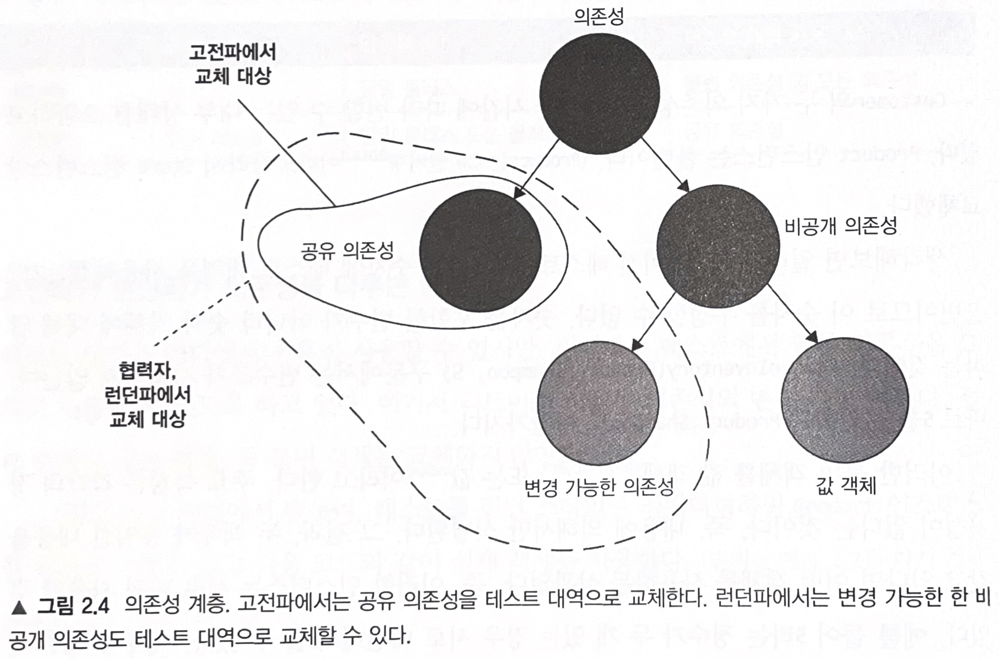

# [단위 테스트] 1. 더 큰 그림

---

# 2장. 단위테스트란 무엇인가

## 정의

단위테스트는

- 작은 코드조각을 검증하고
- 빠르게 수행하고
- 격리된 방식으로 처리하는 자동화된 테스트이다

### 런던파

클래스가 다른 크래스에 의존하면 의존성을 테스트 대역으로 대체하여 동작을 외부 영향과 분리해서 테스트 대상 클래스에만 집중

어느 클래스가 고장난 것인지 알기 쉽다

### 고전파

코드를 격리해서 실행하는 것이 아니라 단위 테스트를 격리해서 실행

테스트들을 알맞은 순서로 실행하여 서로의 결과에 영향을 미치지 않음

```java
public void Purchase_fails_when_not_enough_inventory()
{
	//준비
    var store = new Store();
    store.AddInventory(Product.shampoo, 10);
    var customer = new Customer();
    
    //실행
   	bool success = customer.Purchase(store, Product.Shampoo, 15);
    
    //검증 (실패 했기에 수량 변화가 없음)
    Assert.False(success);
    Assert.Equals(10, store.GetInventory(Product.Shampoo));
 }

public void Purchase_fails_when_not_enough_inventory()
{
	//준비
    var store = new Mock<IStore>();
    storeMock
    	.Setup(x => x.HasEnoughInventory(Product.Shampoo, 5))
        .Return(false)
    var customer = new Customer();
    
    //실행
   	bool success = customer.Purchase(storeMock.Object, Product.Shampoo, 5);
    
    //검증 (실패 했기에 수량 변화가 없음)
    Assert.False(success);
    storeMock.Verify(
    	x => x.RemoveInventory(Product.Shampoo, 5),
        Times.Never);
 }
```

### 비교

주요 차이는 단위 테스트의 정의에서 격리 문제를 어떻게 다루는지에 있다

|  | 격리 주체 | 단위의 크기 | 테스트 대역 |
| --- | --- | --- | --- |
| 런던식 | 단위 | 단일 클래스 | 불변의존성 외 모든 의존성 |
| 고전파 | 단위 테스트 | 단일 클래스 또는 클래스 세트 | 공유 의존성 |

<br>



런던파 장점

- 한 번에 한 클래스씩 확인
    
    클래스가 꼭 좋은 단위가 아닐 수 있다
    
- 클래스가 서로 연결되어도 협력자들은 테스트 대역으로 대체되기 때문에 테스트 하기 쉽다
    
    의존성이 복잡한다는 것은 코드 설계 문제일 수 있다
    
- 테스트 실패 시, 어떤 기능이 실패했는지 알기 쉽다
    
    이전 수정을 살펴보면 알 수 있고 단계적으로 실행해나가면서 코드를 살피면 된다
    

### 차이점

- 테스트 주도 개발을 통한 시스템 설계 방식
    
    런던식은 상위 레벨 테스트부터 시작하는 하향식 TDD로
    
    고전파는 상향식으로 한다
    
- 과도한 명세 문제
    
    런던식은 고전파보다 테스트가 구현에 더 자주 결합된다
    
    이로 인해 런던식과 목을 아무 데나 쓰는 것에 대해 이의가 제기된다
    

### 통합 테스트

런던식은 대역 없이 실제 협력자를 사용하면 모두 통합 테스트로 간주

단위 테스트는

- 단일 동작 단위를 검증하고
- 빠르게 수행하고
- 다른 테스트와 별도로 처리한다.

통합 테스트는 이 중 하나를 충족하지 않는 테스트이다