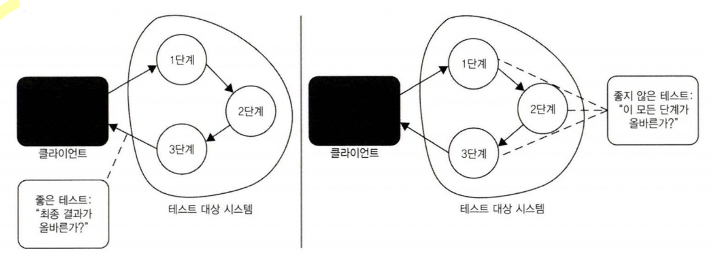
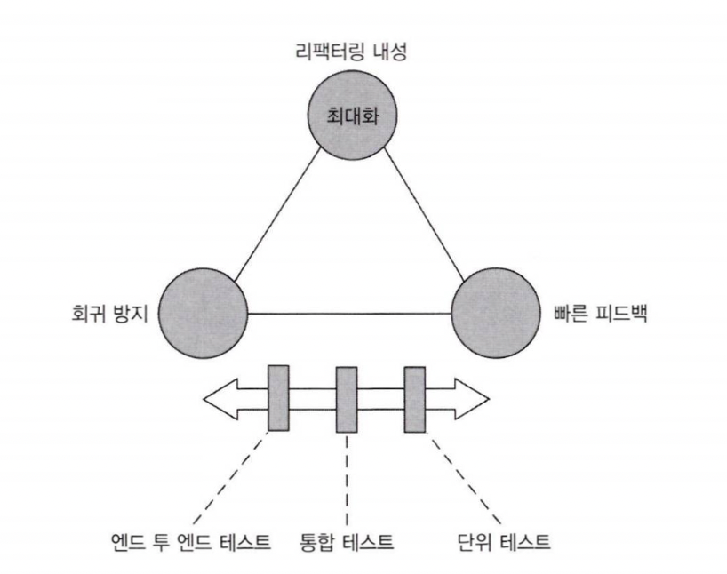

# 단위 테스트 2부 4장

## 개요

4장에서 다루는 내용

- 좋은 단위 테스트의 관점 간 차이점 모색
- 이상적인 테스트 정의
- 테스트 피라미드 이해
- 블랙박스 테스트 및 화이트박스 테스트 사용

좋은 단위 테스트 스위트의 특성

- 개발 주기에 통합돼 있다. 실제로 사용하는 테스트에만 가치가 있다. 그렇지 않으면 작성해도 의미가 없다.
- 코드베이스의 가장 중요한 부분만을 대상으로 한다. 모든 실행 코드에 똑같이 신경 쓸 필요가 없다. 애플리케이션의 핵심(도메인 모델)을 다른 것과 구별하는 것이 중요하다.
- 최소한의 유지비로 최대 가치를 끌어낸다. 이 마지막 특성을 달성하려면 다음 두가지를 할 수 있어야한다.
    - 가치 있는 테스트 식별
    - 가치 있는 테스트 작성

## 4.1 좋은 단위 테스트의 4대 요소 자세히 살펴보기

- 회귀 방지
- 리팩터링 내성
- 빠른 피드백
- 유지 보수성

### 4.1.1 첫 번째 요소: 회귀 방지

회귀 방지 지표에 대한 고려 사항

- 테스트 중에 실행되는 코드의 양 - 코드의 양을 적게
- 코드 복잡도 - 복잡도를 낮추게
- 코드의 도메인 유의성 - 비즈니스 로직에 집중, 도메인에 집중

### 4.1.2 두 번째 요소: 리팩토링 내성

이게 머야? 

테스트를 빨간색으로 바꾸지 않고 기본 애플리케이션 코드를 리팩터링 할 수 있는지에 대한 척도

### 거짓 양성(false positive)

실제로 기능이 의도한 대로 정상 작동하지만 테스트는 실패를 나타내는 결과

거짓 양성이 없는 코드

- 기존 기능이 고장 났을 때 테스트가 조기 경고를 제공한다.
- 코드 변경이 회귀로 이어지지 않을 것이라고 확신하게 된다.

거짓 양성이 있는 코드

- 테스트가 타당한 이유 없이 실패하면, 코드 문제에 대응하는 능력과 의지가 희석된다.
- 테스트 스위트에 대한 신뢰가 서서히 떨어지며, 더 이상 믿을 만한 안전망으로 인식하지 않는다.
허위 경보로 인식이 나빠지고 신뢰가 부족해지면 리팩터링이 줄어든다.

### 4.1.3 무엇이 거짓 양성의 원인인가?

테스트와 테스트 대상 시스템(SUT)의 구현 세부 사항이 많이 결합할수록 허위 경보가 더 많이 생긴다.

해당 구현 세부 사항에서 테스트를 분리하여 거짓 양성이 생길 가능성을 줄여야한다.

테스트는 최종 사용자의 관점에서 SUT를 검증해야하고 최종 사용자에게 의미 있는 결과만 확인해야 한다.

### 4.1.4 구현 세부 사항 대신 최종 결과를 목표로 하기

위의 그림과 같이 구현 세부 사항 대신 최종 결과를 목표로 한다면 거짓 양성을 줄 일 수 있다.

## 4.2 첫 번째 특성과 두 번째 특성 간의 본질적인 관계

- 테스트 정확도 극대화
- 거짓양성과 거짓음성의 중요성

### 4.2.1 테스트 정확도 극대화

거짓 양성을 피하는 데에는 리팩터링 내성이 도움이 된다.

테스트 정확도 = 신호(발견된 버그 수) / 소음(허위 경보 발생 수)

회귀 방지와 리팩터링 내성은 테스트 스위트의 정확도를 극대화하는 것을 목표로 한다.

- 테스트 버그가 있음을 얼마나 잘 나타내는가?
- 테스트가 버그 없음을 얼마나 잘 나타내는가?

### 4.2.2 거짓 양성과 거짓 음성의 중요성: 역학 관계

초기에는 리팩터링이 바로 중요하지 않기에 거짓 양성의 중요성이 떨어진다.

하지만 시간이 지나면 코드 베이스는 나빠진다. 점점 복잡해지고 체계성이 떨어지게 된다.

이런 경향을 줄이기 위해 정기적으로 리팩터링을 해야한다. 그렇기에 후반으로 갈수록 거짓 양성의 중요성이 올라가게된다.

## 4.3 세 번째 요소와 네 번째 요소: 빠른 피드백과 유지 보수성

### 빠른 피드백과 유지 보수성

당연하게도 테스트는 빠를 수록 좋다.

유지 보수성 지표는 유지비를 평가하고 아래와 같은 두가지 주요 요소로 구성되어있다.

- 테스트가 얼마나 이해하기 어려운가
테스트 크기와 관련이 있다. 작은 테스트는 필요할 때 변경하기 쉽지만 반대는 어렵다.
- 테스트가 얼마나 실행하기 어려운가
외부 종속성으로 작동하면 의존성을 상시 운영하는데 시간을 들여야한다.

## 4.4 이상적인 테스트를 찾아서

모든 면에서 좋은 이상적 테스트는 만들 수 없다.

- 회귀 방지
- 리팩터링 내성
- 빠른 피드백
- 유지 보수성

회귀 방지, 리팩터링 내성, 빠른 피드백은 상호 배타적이기 때문에 셋 중 하나를 희생해야 나머지 둘을 최대로 할 수 있다.

모두를 곱하는 것으로 가치가 결정되어 하나가 0이면 결과적으로 0이 된다.

극단적 사례를 살펴보자

- 엔드 투 엔드 테스트
회귀 오류와 거짓 양성에 대한 방지를 휼룡히 해내지만 속도가 떨어진다.
- 간단한 테스트
우수한 리팩터링 내성과 빠른 피드백을 제공하지만 회귀 방지가 없다.
- 깨지기 쉬운 테스트
실행이 빠르고 회귀를 잡을 가능성이 높지만 거짓 양성이 많은 테스트를 작성하기가 매우 쉽다.

## 4.5 대중적인 테스트 자동화 개념 살펴보기

피라미드의 상단으로 갈수록 회귀 방지에 유리한 반면 하단은 실행 속도를 강조한다.

어느 계층도 리팩터링 내성을 포기하지는 않는다.

테스트 피라미드에는 예외를 가지고 있다. 모든 어플리케이션이 비즈니스 규칙이나 기타 복잡도가 거의 없는 기본적인 CRUD작업이라면 테스트는 '피라미드'는 단위 테스트와 통합 테스트의 수가 같고 엔드 투 엔드 테스트가 없는 직사각형 처럼 보일 것이다.
또 외부 의존성 하나만 연결하는 API 또한 예외를 가진다.

### 4.5.2 블랙박스 테스트와 화이트박스 테스트 간의 선택

- 화이트 박스: 내부 작업을 검증하는 테스트 방식이고 테스트는 요구 사항이나 명세가 아닌 소스코드에서 파생
- 블랙 박스: 시스템의 내부 구조를 모르더라도 시스템 기능을 검사할 수 있는 소프트웨서 테스트 방법, 어떻게가 아닌 무엇을 해야 하는지 중심으로 구축된다.

