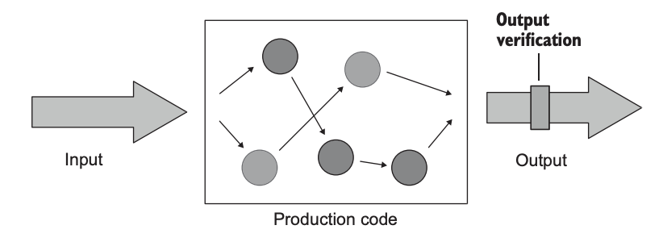

# [UnitTesting 6장. 단위 테스트 스타일

# 3 styles of unit testing

1. Output-based testing
2. State-based testing
3. Communication-based testing

- 하나 또는 그 이상의 테스팅 스타일을 적용하여 단위 테스트를 할 수 있다.

## output-based style

- 테스트 중인 시스템(SUT)에 입력을 넣고 생성되는 출력을 확인하는 출력 기반의 스타일
    - 전역 또는 내부 상태를 변경하지 않는 코드에만 적용 가능 (**Side-effect**가 없다)
    - 확인할 수 있는 결과는 출력 값 (리턴 값) 뿐이다.



```java
public class PriceEngine {
	public decimal CalculateDiscount(params Product[] products) {
			decimal discount = products.Length * 0.01m;
			return Math.Min(discount, 0.2m);
		}
}

// [Fact]
public void Discount_of_two_products() {
	var product1 = new Product("Hand wash");
	var product2 = new Product("Shampoo");
	var sut = new PriceEngine();
	decimal discount = sut.CalculateDiscount(product1, product2);
	Assert.Equal(0.02m, discount);
}
```

- PriceEngine Test
    - products의 수에 0.01을 곱한 것을 0.2로 제한한다.
    - products를 collection에 추가 하지도 않고 데이터베이스에 유지 하지도 않는다.
    
    
    

## state-based style

- 작업이 완료된 후 시스템 상태를 확인하는 것
    - 상태(state) : SUT 자체, 협력자, 데이터베이스나 파일 시스템 등의 프로세스 외부 의존성 등


```java
public class Order {
	private readonly List<Product> _products = new List<Product>();
	public IReadOnlyList<Product> Products => _products.ToList();

	public void AddProduct(Product product) {
		_products.Add(product);
	}
}

// [Fact]
public void Adding_a_product_to_an_order() {
	var product = new Product("Hand wash");
	var sut = new Order();
	sut.AddProduct(product);
	Assert.Equal(1, sut.Products.Count);
	Assert.Equal(product, sut.Products[0]);
}
```

- AddProduct를 통해 **Order의 상태를 변경**
    
    

## communication-based style

- Mock을 사용하여 테스트 중인 시스템과 협력자 간의 통신을 확인한다.


```java
// [Fact]
public void Sending_a_greetings_email() {
	var emailGatewayMock = new Mock<IEmailGateway>();
	var sut = new Controller(emailGatewayMock.Object);

	sut.GreetUser("user@email.com");

	emailGatewayMock.Verify(
	x => x.SendGreetingsEmail("user@email.com"),
	Times.Once);
}
```

- Controller와 EmailGateWay 사이에 통신이 잘 이루어졌는지 확인한다.
    - 새 유저가 가입했으면 환영 이메일이 1번만 전송되어야 한다.

---

# Comparing the 3 styles of unit testing

- 회귀 방지 (Protection against regressions)
- 리팩토링에 대한 내성 (Resistance to refactoring)
- 빠른 피드백 (Fast feedback)
- 유지보수성 (Maintainability)

## 리팩토링 내성 비교

- 출력 기반 테스트
    - 테스트가 테스트 대상 메서드하고만 연관이 있음 (리팩토링 내성 good)
    - 구현 세부사항과 결합하는 경우는 테스트 대상 메서드가 구현 세부사항 자체일 경우 뿐
- 상태 기반 테스트
    - 리팩토링 내성이 약함
    - 테스트 대상 메서드 외에도 현재 인스턴스 상태와 함께 작동함 (구현 세부사항과 연관이 있을 가능성이 높음)
- 통신 기반 테스트
    - 상호작용하는 것을 검증하는 테스트 → 가장 깨지기 쉬움
    - 외부 의존성 프로세스와의 작용이 바깥에서도 보인다면 Mock을 이용해 테스트 하는 것이 좋음

## 유지보수성 비교

- 테스트를 이해하기 얼마나 어려운가?
- 테스트를 실행하기 얼마나 어려운가?

- 출력 기반 테스트
    - 유지보수 용이
    - 전역 상태, 내부 상태를 바꾸지 않기 때문
- 상태 기반 테스트
    - 유지보수 비용이 높음
    - 많은 상태를 확인해야 하는 검증 코드가 길어질 수 있음
        1. 코드를 숨기고 테스트를 단축하는 헬퍼 메서드 (코드 비용)
        2. 검증 대상 클래스의 동등 멤버를 정의 (클래스가 값에 해당할때만 효과적)
- 통신 기반 테스트
    - Mock과의 상호 작용 검증 → 코드량이 많다.
    - Mock이 chain 형태로 있는 경우,,

- State verification that takes up a lot of space

```java
// [Fact]
public void Adding_a_comment_to_an_article() {
	var sut = new Article();
	var text = "Comment text";
	var author = "John Doe";
	var now = new DateTime(2019, 4, 1);

	sut.AddComment(text, author, now);

	Assert.Equal(1, sut.Comments.Count);
	Assert.Equal(text, sut.Comments[0].Text);
	Assert.Equal(author, sut.Comments[0].Author);
	Assert.Equal(now, sut.Comments[0].DateCreated);
}
```

- Using helper methods
    - ShouldContainNumberOfComments(), WithComment 활용

```java
// [Fact]
public void Adding_a_comment_to_an_article() {
	var sut = new Article();
	var text = "Comment text";
	var author = "John Doe";
	var now = new DateTime(2019, 4, 1);

	sut.AddComment(text, author, now);

	sut.ShouldContainNumberOfComments(1)
		.WithComment(text, author, now);
}
```

- Comment compared by value
    - Comment를 비교 가능한 값처럼 사용한다.

```java
// [Fact]
public void Adding_a_comment_to_an_article() {
	var sut = new Article();
	var comment = new Comment(
		"Comment text",
		"John Doe",
		new DateTime(2019, 4, 1));

sut.AddComment(comment.Text, comment.Author, comment.DateCreated);
sut.Comments.Should().BeEquivalentTo(comment);
```

- 결과
    - 리팩토링 내성을 가지기 위해 필요한 노력
    - 유지 보수 비용


- 가급적이면 출력 기반 테스트 코드를 작성하도록 하지만, 대부분의 객체지향 언어에는 해당되지 않는다는 문제

---

# Understanding functional architecture

- in 객체 지향 프로그래밍
    - 대부분 상태 기반 / 통신 기반 테스트
    - 출력 기반 테스트 스타일을 사용하기 위해서 **객체 지향 프로그래밍 → 함수형 아키텍처**로 바꾸는 것이 도움이 된다.

- 순수 함수를 이용한 프로그래밍
    - 숨은 입출력이 없는 함수


- 숨은 입출력?
    - 사이드 이펙트 (Side-effect)
        - 메서드 선언부에 표시되지 않은 출력
        - 클래스 인스턴스의 상태를 변경, 파일 업데이트 등
    - Exceptions
        - 메서드가 예외를 던지면, 새로운 프로그램 흐름이 되버린다.
    - 내/외부 상태에 대한 참조(reference)
        - System.DateTime.Now() 등 시스템 상태를 참조

```java
public boolean isExistedInShop(Product product) {
    itemCount++;  // side effect
    return itemList.contains(product);
}
```

## 함수형 아키텍처

<aside>
🌱 사이드 이펙트를 없애는 것이 아니라, 사이드 이펙트와 비즈니스 로직을 분리하는게 목표

</aside>

- 비즈니스 로직을 수행한 뒤 → 사이드 이펙트가 실행되도록 한다.
    - 결정을 내리는 코드 : 사이드 이펙트가 필요없다. 함수를 사용해 작성 가능
    - 결정에 따라 작용하는 코드 → 함수에 의해 만들어진 결정을 DB 변경, 메세지 전송, 인스턴스 상태 변경 등의 가시적인 부분으로 변환


- 가변 쉘 : 함수형 코어에 전달할 입력을 준비. 결정에 따라 동작
- 함수형 코어 : 비즈니스 로직 수행. 결정 생성

비즈니스 로직이 모여있는 메서드(함수형 코어)를 **출력 기반 테스트**로 테스트 할 수 있다.

### 실제 리팩토링


- 가장 최근 파일의 마지막 줄에 방문자 이름과 방문 시간을 추가하는 시스템
    - 방문자 이름 + “;” + 방문 시간
    - 파일이 가질 수 있는 max line에 도달하면 인덱스를 증가시키고, 새로운 파일 작성

```java
public class AuditManager {
	private readonly int _maxEntriesPerFile;
	private readonly string _directoryName;

	public AuditManager(int maxEntriesPerFile, string directoryName) {
		_maxEntriesPerFile = maxEntriesPerFile;
		_directoryName = directoryName;
	}
	
	public void AddRecord(string visitorName, DateTime timeOfVisit) {
		string[] filePaths = Directory.GetFiles(_directoryName);
		(int index, string path)[] sorted = SortByIndex(filePaths);

		**string newRecord = visitorName + ';' + timeOfVisit;**

		if (sorted.Length == 0) {
			string newFile = Path.Combine(_directoryName, "audit_1.txt");
			File.WriteAllText(newFile, newRecord);
			return;
		}

		(int currentFileIndex, string currentFilePath) = sorted.Last();
		List<string> lines = File.ReadAllLines(currentFilePath).ToList();

		if (lines.Count < _maxEntriesPerFile) {
			lines.Add(newRecord);
			string newContent = string.Join("\r\n", lines);
			File.WriteAllText(currentFilePath, newContent);
		} else {
				int newIndex = currentFileIndex + 1;
				string newName = $"audit_{newIndex}.txt";
				**string newFile = Path.Combine(_directoryName, newName);**
				File.WriteAllText(newFile, newRecord);
			}
		}
}
```

- 테스트 관점에서 바라보았을 때
    - AuditManager와 파일 시스템이 강하게 결합되어 있음 (의존성)
        - 메서드가 파일 시스템의 특정 파일을 참조
    - 테스트를 하기 위해 File System / Audit System을 분리해야 함
        - 파일 시스템은 Audit 시스템에 입력을 넣어줌
        - Audit 시스템은 출력을 File System으로 보내주고 테스트는 이것을 검증하는 것
    
    
    
- Mock 사용
    - 테스트가 외부 시스템과 밀접하게 결합
    - 파일과 관련된 모든 연산을 별도의 IFileSytem으로 추출 → AuditManager에 주입한다.


- IFileSystem
    - 파일 시스템과 커뮤니케이션 하는 부분을 클래스로 만든다.

```java
public interface IFileSystem {
    String[] getFiles(String directoryName);
    void WriteAllText(String filePath, String content);
    List<String> ReadAllLines(String filePath);
}
```

- AuditManager

```java
public class AuditManager {
	private readonly int _maxEntriesPerFile;
	private readonly string _directoryName;
	**private readonly IFileSystem _fileSystem;**
	
	public AuditManager(
		int maxEntriesPerFile,
		string directoryName,
		**IFileSystem fileSystem**
	) {
		_maxEntriesPerFile = maxEntriesPerFile;
		_directoryName = directoryName;
		_fileSystem = fileSystem;
	}
}
```

- addRecord()

```java
public void addRecord(string visitorName, DateTime timeOfVisit) {
	string[] filePaths = _fileSystem.getFiles(_directoryName); // 새로운 인터페이스 이용
	(int index, string path)[]sorted = SortByIndex(filePaths);
	string newRecord = visitorName + ";" + timeOfVisit;

	if (sorted.length == 0) {
		string newFile = Path.Combine(_directoryName, "audit_1.txt");
		_fileSystem.WriteAllTexts(newFile, newRecord); // 새로운 인터페이스 이용
	  return;
	}

  (int currentFileIndex, string currentFilePath) = sorted.Last();
  List<string> lines = _fileSystem.ReadAllLines(currentFilePath).ToList(); // 새로운 인터페이스 이용

  if (lines.Count < _maxEntriesPerFile) {
       lines.add(newRecord);
       string newContent = string.Join("\r\n", lines);
       _fileSystem.WriteAllText(currentFilePath, newContent); // 새로운 인터페이스 이용
  } else {
       int newIndex = currentFileIndex + 1;
       string newName = $ "audit_{newIndex}.txt";
       string newFile = Path.Combine(_directoryName, newName);
       _fileSystem.WriteAllText(newFile, newRecord); // 새로운 인터페이스 이용
	}
}
```

- 실제 테스트 코드
    - 어떤 시스템을 사용 할지 결정 가능 → Mock을 주입 가능

```java
// [Fact]
public void A_new_file_is_created_when_the_current_file_overflows() {

	var fileSystemMock = new Mock<IFileSystem>();
	fileSystemMock
		.Setup(x => x.GetFiles("audits"))
		.Returns(new string[]
		{
			@"audits\audit_1.txt",
			@"audits\audit_2.txt"
		});

	fileSystemMock
		.Setup(x => x.ReadAllLines(@"audits\audit_2.txt"))
		.Returns(new List<string>
		{
			"Peter; 2019-04-06T16:30:00",
			"Jane; 2019-04-06T16:40:00",
			"Jack; 2019-04-06T17:00:00"
		});

	var sut = new AuditManager(3, "audits", fileSystemMock.Object);

	sut.AddRecord("Alice", DateTime.Parse("2019-04-06T18:00:00"));

	fileSystemMock.Verify(x => x.WriteAllText(
		@"audits\audit_3.txt",
		"Alice;2019-04-06T18:00:00"
	));
}
```

### 사이드 이펙트와 비즈니스 로직을 둘다 분리하기

- AuditManager 담당하던 비즈니스 로직 + 사이드 이펙트를 분리해보자
    - AuditManager : input을 받아서 결정을 생성하기만 함
    - Persister : 정보를 모아서 전달, 결정을 받아서 그에대한 사이드 이펙트 처리


- AuditManager가 FileSystem을 주입받는 것이 아니라 FileContent를 주입받는다.
    - 비즈니스 로직을 처리하는데 필요한 “정보” 자체를 받는 것

```java
public class AuditManager {

    private readonly int _maxEntriesPerFile;

    public AuditManager(int maxEntriesPerFile){
        _maxEntriesPerFile = maxEntriesPerFile;
    }

    // 의사 결정 정보를 담은 FileUpdate를 돌려준다.
    public **FileUpdate** addRecord(**FileContent[] files**, String visitorName, DateTime timeOfVisit) {

        (int index, FileContent file)[]sorted = SortByIndex(files);

        string newRecord = visitorName + ";" + timeOfVisit;

        if (sorted.length == 0) {
            return new FileUpdate("audit_1.txt", newRecord);
        }

        (int currentFileIndex, FileContent currentFile) = sorted.Last();
        List<string> lines = currentFile.Lines.ToList();

        if (lines.Count < _maxEntriesPerFile) {
            lines.add(newRecord);
            string newContent = string.Join("\r\n", lines);
            **return new FileUpdate(currentFile.FileName, newContent);**
        } else {
            int newIndex = currentFileIndex + 1;
            string newName = $ "audit_{newIndex}.txt";
            **return new FileUpdate(newName, newRecord);**
        }
    }
}
```

- FileContent
    - input

```java
public class FileContent {
	public readonly string FileName;
	public readonly string[] Lines;
	public FileContent(string fileName, string[] lines) {
		FileName = fileName;
		Lines = lines;
	}
}
```

- FileUpdate
    - 결정 정보

```java
public class FileUpdate {
	public readonly string FileName;
	public readonly string NewContent;
	public FileUpdate(string fileName, string newContent) {
		FileName = fileName;
		NewContent = newContent;
	}
}
```

- Persister는 AuditManager에게 전달할 input 정보를 모은 FileContent 객체를 생성
    - AuditManager로부터 FileUpdate 객체를 받아서 업데이트 진행

```java
public class Persister {

    public FileContent[] ReadDirectory(string directoryName){
        return Directory
                .GetFiles(directoryName)
                .Select(x => new FileContent(
                        Path.GetFileName(x),
                        File.ReadAllLines(x)))
                .ToArray();
    }

    public void ApplyUpdate(string directoryName, FileUpdate update) {
        string filePath = Path.Combine(directoryName, update.Filename);
        File.WirteAllText(filePath, update.newContent);
    }
}
```

- ApplicationService는 AuditManager와 Persister를 연결

```java
public class ApplicationService {

    private readonly string _directoryName;
    **private readonly AuditManager _auditManager;
    private readonly Persister _persiste;**

    public ApplicationService(string directoryName, int maxEntriesPerFile) {
        _directoyrName = directoryName;
        _auditManager = new AuditManager(maxEntriesPerFile);
        _persister = new Persister();
    }

    public void AddRecord(string visitorName, DateTime timeOfVisit) {
        FileContent[] files = _persister.ReadDirectory(_directdoryName);
        FileUpdate update = _auditManager.AddRecord(files, visitorName, timeOfVisit);
        _persister.ApplyUpdate(_directoryName, update);
    }
}
```

- 실제 테스트
    - 복잡한 비즈니스 로직은 AuditManager에 있음
    - 그외 사이드 이펙트는 Persister로 분리
    - **AuditManager를 출력 기반으로 테스트 하면 된다.**

```java
// [Fact]
public void A_new_file_is_created_when_the_current_file_overflows() {
	var sut = new AuditManager(3);
	var files = new FileContent[] {
		new FileContent("audit_1.txt", new string[0]),
		new FileContent("audit_2.txt", new string[] {
			"Peter; 2019-04-06T16:30:00",
			"Jane; 2019-04-06T16:40:00",
			"Jack; 2019-04-06T17:00:00"})
	};

	FileUpdate update = sut.AddRecord(
		files, "Alice", DateTime.Parse("2019-04-06T18:00:00"));

	Assert.Equal("audit_3.txt", update.FileName);
	Assert.Equal("Alice;2019-04-06T18:00:00", update.NewContent);
}
```

- 함수형 코어와 가변 쉘을 연결 시켜 줄 클래스 → ApplicationService (FileContent, FileUpdate)

---

# Understanding the drawbacks of functional
architecture

- 만약 의사 결정을 하는 과정에서 정보가 더 필요해서 DB와 통신이 필요해졌다.
    - 의사 결정 메서드에 DB 통신 객체를 전달할 수 있다.
    - “숨은 입력”이 추가되는 것
    
    ```java
    public FileUpdate AddREcord(
    	FileContent[] files, 
    	String visitorName, 
    	DateTime timeOfVisit, 
    	**IDatabase database**
    );
    ```
    
    
    

- 순수 함수가 아니라 출력 기반 테스트를 할 수 없다.
    - 어플리케이션 서비스 시작 전에 DB에서 모든 정보를 일괄 가져온다.
        - 필요 없는 경우에도 DB를 조회
    - AuditManager에 isAccessLevelCheckRequired() 라는 메서드를 둔다.
        - Application에서 AddRecord 호출 전에 이 메서드를 호출하여 true이면 DB에 접근한다.
        - DB를 호출할지에 대한 결정을 ApplicationService에게 넘긴다.

- 함수형 아키텍처는 유지 보수성 향상을 위해 성능을 희생
    - 성능 ↔ 유지보수 간의 절충이 필요
- 
- **이런 순수성을 지키기 위해 비용이 많이 든다면 순수성을 따르지 말아라.**
    - 출력 기반 테스트에만 의존할 수는 없다.
    - 대부분 출력+상태 스타일을 섞으며, 통신 기반 스타일을 약간 가미한다.

---

# 요약

- 출력 기반 테스트, 상태 기반 테스트, 통신 기반 테스트
- 출력 기반 테스트가 품질이 가장 좋다.
- 함수형 프로그래밍의 목표는 사이드 이펙트를 비즈니스 로직에서 분리하는 것이다.
- 함수형 아키텍쳐는 모든 코드를 함수형 코어(비즈니스 로직)과 가변 셸(사이드 이펙트)로 나눈다.
- 모든 코드베이스를 함수형 아키텍처로 전환할 수 없다.
