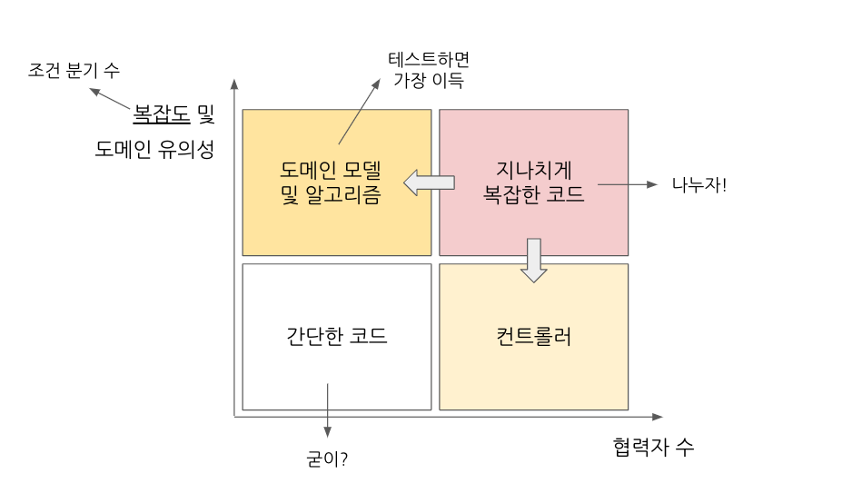
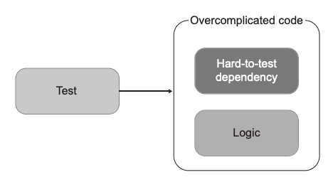
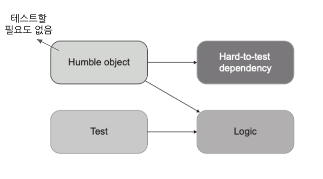
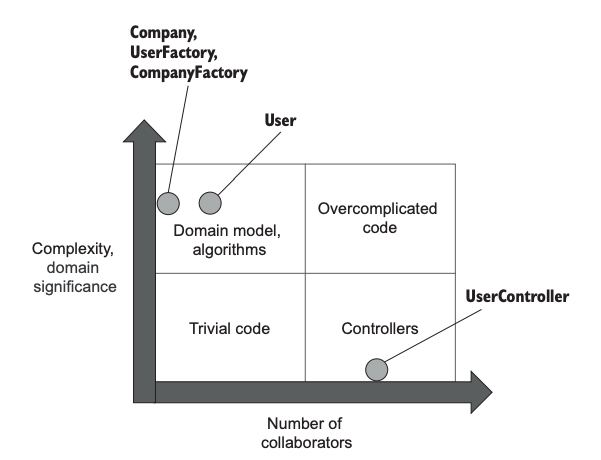
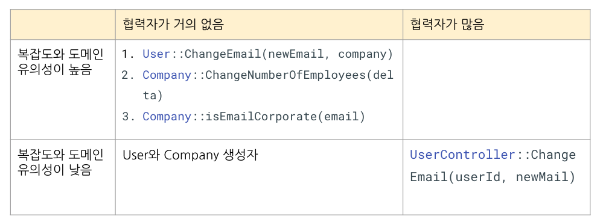
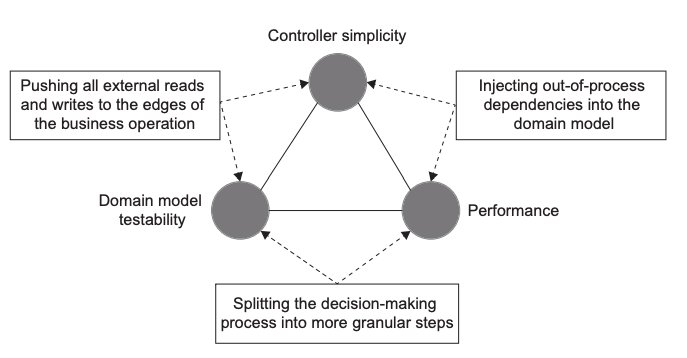

# Chapter 7. 가치 있는 단위 테스트를 위한 리팩터링

- 좋은 단위테스트는 코드베이스 중 가장 중요한 부분만을 대상으로 한다.
- 단위테스트는 코드베이스와 얽혀 있다. → 코드베이스도 깔끔해야 단위테스트도 깔끔
- 그래서 앞에서.. 코드베이스의 아키텍처에 대해 살펴봄
  - 함수형 아키텍처를 이용해 출력 기반 테스트로 전환하는 등
- 이런 식으로, 전반적인 소프트웨어 프로젝트에서 가치 있는 테스트를 작성하기 위해 코드베이스를 어떻게 리팩터링하고 테스트를 작성할 지 살펴보자.

## 7.1 리팩터링할 코드 식별하기

코드베이스가 어떻게 돼있어야 테스트하기 좋을까?

### 코드의 네 가지 유형

우선 코드베이스의 유형을 알아보자. 모든 코드는 2차원으로 분류할 수 있다.



- 복잡도가 높거나 도메인 유의성이 높을 수록 테스트해야하는 코드
- 도메인 모델에서 외부 협력자를 쓴다면, 도메인 계층 외부 클래스에게 위임하자.

### 어떻게 잘 나눌까? → 험블 객체 패턴





- 앞에서 봤던 육각형 아키텍처나 함수형 아키텍처도 모두 이 패턴
- +) SRP를 지키게 됨
- 대부분의 패턴이나 원칙은 결국 험블 객체를 나누는 것과 같음

### 장점

- 테스트 용이성만 있는 게 아님
- 코드 복잡도 해결 → 장기적인 프로젝트 성장

## 7.2 가치 있는 단위 테스트를 위한 리팩터링하기

그럼 험블 객체 패턴을 이용해서 코드를 리팩터링하는 예시를 살펴보자.

### 초기 구현

- 이메일 변경이라는 유스 케이스만 있음.
- 이 때, 이메일이 회사 도메인에 속하면 직원임 → 직원 수를 추적해야함
- 이메일 변경시에 외부 시스템에 메시지를 보내서 알려야함

```C#
public class User
{
	public int UserId { get; private set; }
	public string Email { get; private set; }
	public UserType Type { get; private set; }

	// Use case
	public void ChangeEmail(int userId, string newEmail)
	{
		// 데이터베이스에서 검색
		object[] data = Database.GetUserById(userId);
		UserId = userId;
		Email = (string)data[1];
		Type = (UserType)data[2];
		
		// 변경할 필요 X
		if (Email == newEmail)
			return;

		// 직원인지 살펴보기 위해 회사 도메인 + 직원수 데이터베이스에서 검색
		object[] companyData = Database.GetCompany();
		string companyDomainName = (string)companyData[0];
		int numberOfEmployees = (int)companyData[1];
		
		// 현재 이메일 도메인
		string emailDomain = newEmail.Split('@')[1];

		bool isEmailCorporate = emailDomain == companyDomainName;
		UserType newType = isEmailCorporate
			? UserType.Employee
			: UserType.Customer;

		// 이메일 유형 변경됨
		if (Type != newType)
		{
			// 유저 -> 직원이었으면 +1; 반대는 -1
			int delta = newType == UserType.Employee ? 1 : -1;
			int newNumber = numberOfEmployees + delta;
			// 직원수 추적해야하므로 DB에 저장
			Database.SaveCompany(newNumber);
		}
		Email = newEmail;
		Type = newType;
		// DB에 바뀐 이메일 저장
		Database.SaveUser(this);
		// 이메일 바뀐 것 외부에 전송
		MessageBus.SendEmailChangedMessage(UserId, newEmail);
	}
}

public enum UserType
{
	Customer = 1,
	Employee = 2
}
```

- 코드 복잡도는 그리 높지 않지만, 어떨 때 유저가 직원인지, 회사 직원 수는 어떻게 업데이트 하는 지 등등.. → 모두 비즈니스 로직
- 게다가 코드 안에 외부 의존성이 숨어 있음 → Database / MessageBus
- 따라서 이 코드는 지나치게 복잡한 코드!

### 암시적 의존성을 명시적으로

Database나 MessageBus를 함수 내부에서 쓰는 게 아니라 parameter로 받는 등.. 어떻게 참조하든 결국 외부에 있는 건 같다. → 테스트시 mock 처리 필요

앞서 말한 대로 아예 외부 협력자에 의존하지 않게 하고, 도메인 모델 외부로 위임하는 게 낫다.

### 애플리케이션 서비스 계층 도입

외부 의존성과 통신하는 `UserController`를 따로 만들자. `UserController`가 DB, MessageBus 통신 등을 담당하고, User에는 변경될 이메일, 회사 도메인, 직원 수만 넘겨준다. 이제 `User`는 협력자는 없는 도메인 모델이 되게 된다.

```C#
public int ChangeEmail(string newEmail,
string companyDomainName, int numberOfEmployees)
{
	if (Email == newEmail)
		return numberOfEmployees;

	string emailDomain = newEmail.Split('@')[1];
	bool isEmailCorporate = emailDomain == companyDomainName;
	UserType newType = isEmailCorporate
		? UserType.Employee
		: UserType.Customer;

	if (Type != newType)
	{
		int delta = newType == UserType.Employee ? 1 : -1;
		int newNumber = numberOfEmployees + delta;
		numberOfEmployees = newNumber;
	}

	Email = newEmail;
	Type = newType;

	// DB에 변경된 직원 수 저장하기 위해
	return numberOfEmployees;
}
```

### 새로운 Company 클래스

User가 도메인을 통해 회사 이메일인지도 판단하고, 직원수도 직접 업데이트하고 반환까지 하고 있다. User 클래스의 책임이 애매해졌다. 새로운 도메인 클래스인 Company를 만들어야 한다.

```C#
public class Company
{
	public string DomainName { get; private set; }
	public int NumberOfEmployees { get; private set; }

	public void ChangeNumberOfEmployees(int delta)
	{
		Precondition.Requires(NumberOfEmployees + delta >= 0);
		NumberOfEmployees += delta;
	}

	public bool IsEmailCorporate(string email)
	{
		string emailDomain = email.Split('@')[1];
		return emailDomain == DomainName;
	}
}
public class User
{
	// ...

	public void ChangeEmail(string newEmail, Company company)
	{
		if (Email == newEmail)
			return;
		
		// User가 직접 판단하는 게 아닌 company를 통해 판단
		UserType newType = company.IsEmailCorporate(newEmail)
			? UserType.Employee
			: UserType.Customer;

		if (Type != newType)
		{
			int delta = newType == UserType.Employee ? 1 : -1;
			// 직원 수 직접 업데이트
			company.ChangeNumberOfEmployees(delta);
		}

		Email = newEmail;
		Type = newType;

		// 리턴 X
	}
}
```

- Company 관련 결정을 해당 인스턴스가 직접할 수 있도록 위임

### 최종 코드 분류



- User의 협력자가 하나 늘었지만(Company) 이 정도는 테스트하기 괜찮다.
- 테스트 후 부작용이 메모리에 남아있기 때문에 검증하기도 쉽다.
  - User, Company의 field로 저장되어 있으므로 출력, 상태 기반으로 검증 가능

## 7.3 최적의 단위 테스트 커버리지 분석

좋은 단위 테스트는 단순히 단위 테스트 커버리지 100%가 아니라, 중요한 부분에만 테스트를 하는 것.

그럼 어떤 부분에 대한 테스트를 해야 할까?



- 좌측 상단 테스트가 협력자가 거의 없어 테스트하기도 쉽고 회귀 방지도 뛰어나기 때문에 가장 가성비가 좋다.

  - `ChangeEmail`을 예로 들면 이런 경우에 대한 테스트가 필요하다:

    1. 일반 유저 → 직원으로 이메일 변경: 직원수 검증
    2. 직원 → 일반 유저로 이메일 변경: 직원수 검증
    3. 유저 타입 그대로 변경: 직원 수 그대로
    4. 같은 이메일로 변경 시도 (조건 분기 검증)

- 좌측 하단은 단순해서 테스트할 필요가 없다.

- 우측 하단 - Controller는 어떻게 테스트 하는 게 좋을까?

## 7.4 컨트롤러에서 조건부 로직 처리

비즈니스 로직과 컨트롤러 분리는 다음과 같이 비즈니스 연산이 세 단계로 있을 때 가장 효과적이다.

1. 저장소에서 데이터 검색
2. 비즈니스 로직 실행
3. 데이터를 다시 저장소에 저장

하지만 항상 이렇게 단계가 명확하진 않다. 예를 들어 데이터를 검색해서 비즈니스 로직을 실행하는 도중에, 추가적으로 데이터를 조회해야할 수도 있다.

이럴 때 할 수 있는 방법은 세 가지가 있다.

1. 외부에 대한 모든 읽기와 쓰기를 일단 한다. → 세 단계를 유지할 수 있지만 성능 저하 (필요없을 때에도 데이터베이스 조회)
2. 도메인 모델에 프로세스 외부 의존성을 주입하고 비즈니스 로직이 직접 실행 → 도메인 모델이 외부 의존성을 참조하므로 테스트하기 어려워지고 복잡해짐
3. 의사 결정 프로세스 단계를 더 세분화해서 각 단계별로 컨트롤러 실행. → 컨트롤러가 복잡해짐

이 때 중요한 건 도메인 모델 테스트 유의성, 컨트롤러 단순성, 성능 간의 균형을 맞추는 것.




위 방법 모두 모든 특성을 만족할 순 없다.

일단 대부분의 소프트웨어 프로젝트는 성능이 매우 중요하므로 첫 번째 방법은 고려를 하지 않는다.

두 번째 옵션은 도메인 모델이 복잡해져 버린다.

그럼 남은 건 세 번째 옵션이다. 그럼 컨트롤러가 더 복잡해진다. 하지만 그래도? 덜 복잡해지게 하는 방법은 있다.

### CanExecute/Execute 패턴 사용

유저가 이메일을 확인(Confirm)하기 전까지만 이메일을 변경할 수 있다고 해보자.

‘이메일을 확인하기 전’은 비즈니스 로직이기 때문에, 자세한 건 컨트롤러에 공개하지 않고 유저에 해당하는 메서드를 만들어서 해결할 수 있다.

```C#
// User

// 컨트롤러는 어쨌든 바꿀 수 있는지 아닌지만 확인
public string CanChangeEmail()
{
	// 내부 판단 로직은 User에 캡슐화
	if (IsEmailConfirmed)
		return "Can't change a confirmed email";
	return null;
}

public void ChangeEmail(string newEmail, Company company)
{
	Precondition.Requires(CanChangeEmail() == null);
	/* the rest of the method */
} 
```

컨트롤러에서 `CanChangeEmail`을 호출하더라도, 내부 로직은 User에 있기 때문에 Controller를 테스트할 필요가 없게 된다.

### 도메인 이벤트를 사용해 도메인 모델 변경 사항 추적

만약 애플리케이션에 어떤 일이 일어났는지 외부 시스템에 알려야 한다면? 컨트롤러에서 이를 책임지면 컨트롤러가 또 복잡해진다.

이를 피하려면, 도메인 모델에서 중요한 변경 사항이 있을 때 이를 프로젝트 외부 의존성 호출로 변환할 수 있다. → domain event를 사용해 구현할 수 있다.

```C#
public class EmailChangedEvent
{
	public int UserId { get; }
	public string NewEmail { get; }
}

public class User
{
	// ...

	public void ChangeEmail(string newEmail, Company company)
	{
		Precondition.Requires(CanChangeEmail() == null);

		if (Email == newEmail)
			return;
		
		UserType newType = company.IsEmailCorporate(newEmail)
			? UserType.Employee
			: UserType.Customer;

		if (Type != newType)
		{
			int delta = newType == UserType.Employee ? 1 : -1;
			company.ChangeNumberOfEmployees(delta);
		}

		Email = newEmail;
		Type = newType;

		**EmailChangedEvents.Add(
			new EmailChangedEvent(UserId, newEmail));**
	}
}
```

컨트롤러는 `EmailChangedEvents`를 확인해서 외부에 메시지를 보낼 수 있게 된다.

- 어떤 변경이 있을 때 대응하는 Listener들을 호출하는 것과 비슷한 맥락인 듯?

혹은 컨트롤러에서 직접 확인해서 외부에 보내는 게 아닌, 별도의 EventDispatcher를 작성할 수도 있다.

테스트시엔 EmailchangedEvents를 검증해서 원하는 내용의 Event가 제대로 등록됐는지 판단할 수 있을 것이다.

## 7.5 결론

- 이 장에서 살펴본 건, 비즈니스 연산이 끝날 때까지 애플리케이션의 부작용들을 (외부 의존성이 아닌) 메모리에 둬서 단순한 단위 테스트로 테스트하는 것.
- 하지만 항상 완벽하게 CanExecute/Execute 등의 패턴으로 나눌 수는 없을 것이다. → 컨트롤러에서 완전한 비즈니스 로직 분리는 힘들 수 있다.
- 또 도메인에서 완전히 협력자를 제거하는 것도 힘들 수 있다. → 외부 의존성만 아니라면 그래도 크게 복잡해지지 않는다. 어쨌든 중요한 건 목을 통해 협력자 호출을 직접적으로 테스트하지 말 것.
  - 어떤 함수를 불러야하고 등등…. X
  - 결과를 검증하자 → 위 예시같이 EmailChangedEvents나, 출력, 상태를 검증
- 각 계층이 아래의 계층과 어떻게 통신하는지는 무시하자!
