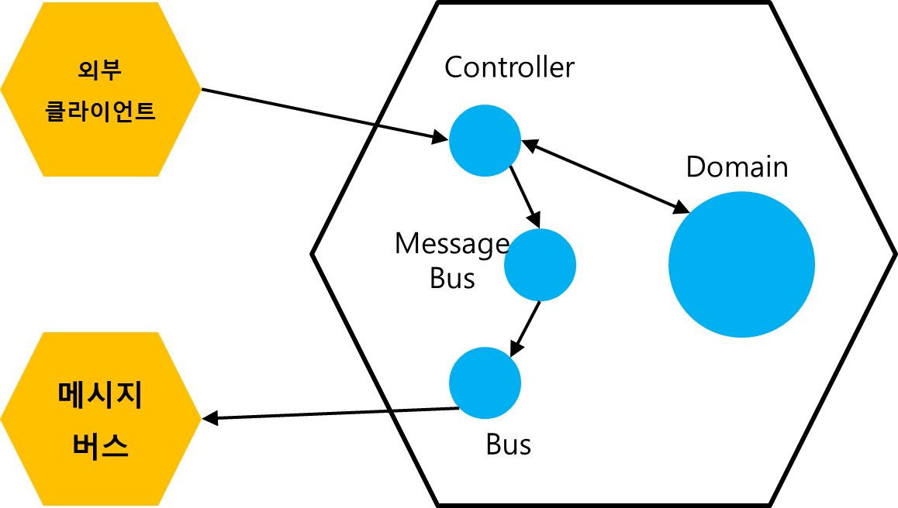

# 9장 목 처리에 대한 모범 사례

### 리마인드

목은? 

테스트 대상 시스템 (SUT) 과 의존성 간의 상호작용을 모방하고 검사하는데 도움이 되는 테스트 대역 

단위테스트 고전파는 단위테스트간의 공유 의존성에 대해서만 목 사용 지침 - _2장_

리팩터링 내성을 위해서 목은 비관리 의존성에만 적용 - _5장, 8장_

c.f. 비관리 의존성?

- 전체를 제어할 수 없는 프로세스 외부 의존성
- 시스템과 해당 의존성의 상호작용을 시스템 외부에서 볼 수 있음
- e.x. SMTP 이메일 발송, 메시지 버스, UMS 메시지 전송 등
- 여러 시스템에서 공유하는 DB 또는 특정 테이블은 비관리 의존성에 속함

프로세스 외부 의존성이라도 관리 의존성에는 목 사용 X

c.f. 관리 의존성

- 전체를 제어할 수 있는 프로세스 외부 의존성
- 우리 시스템을 통해서만 접근할 수 있음
- 외부 환경에서 볼 수 없음
- e.x. 시스템 전용 DB

## 목의 가치 극대화하기

```java
public interface Bus {
    void send(String message);
}

public interface MessageBus {

    void sendEmailChangedMessage(String userId, String email);
}

@RequiredArgsConstructor
public class MessageBusImpl implements MessageBus {
    
    private final Bus bus;
    
    @Override
    public void sendEmailChangedMessage(String userId, String email) {
        bus.send(userId + ": " + email);
    }
}

@Test
void changing_email_from_corporate_to_non_corporate() {
    MessageBus messageBusMock = mock(MessageBus.class);
    DomainLogger loggerMock = mock(DomainLogger.class);

    /* ... */

    verify(messageBusMock, only())
            .sendEmailChangedMessage("user1", "new@gmail.com");
    verify(loggerMock, only())
            .userTypeHasChanged("user1", "employee", "customer");
}
```

### 시스템 끝에서 상호작용 검증하기

이 테스트는 이상적이지 않다. 목을 사용할 때는 **시스템의 끝**에서 비관리 의존성과의 상호작용을 검증해야 한다.



우리 시스템에서 외부 시스템인 메시지 버스를 사용하기 위해서 `Bus`와 `MessageBus` 두 단계의 래퍼를 두었다. `Bus` 는 우리 시스템의 가장 바깥에서 메시지 버스 라이브러리를 사용하기 위한 래퍼이고, `MessageBus` 는 Bus 위의 래퍼로 도메인 기능을 위한 래퍼이다. 

> c.f. 둘은 서로 책임이 다르다.
Bus: 외부 라이브러리의 복잡성을 감추는 안티 코럽션 역할
MessageBus: 모든 애플리케이션 메시지를 보관하는 역할
> 

4장에서 살펴 보았듯 테스트중 실행되는 코드의 양이 많을수록 회귀 방지가 증대된다. 비관리 의존성인 메시지 버스와 통신하는 우리 시스템의 마지막 타입을 목으로 처리했을 때 실행되는 코드의 양이 극대화 된다. 

Bus를 목으로 처리하도록 변경된 테스트 코드

```java
@Test
void changing_email_from_corporate_to_non_corporate_enhanced() {
    Bus busMock = mock(Bus.class);
    MessageBus messageBus = new MessageBusImpl(busMock); // 이전과 달리 메시지버스 구현체 사용

    /* ... */

    // 메시지 버스로 보내는 실제 메시지 검증
    verify(busMock, only())
            .send("user1" + ": " + "new@gmail.com");
}
```

메시지 버스로 보내는 **실제 메시지**가 외부에서 식별하는 유일한 사이드 이펙트이다. 메시지를 실제로 생성하는 클래스는 구현 세부사항일 뿐이다. 

시스템 끝에서 상호작용을 검증하면 리팩터링 내성도 향상된다. 리팩터링을 통해 시스템 구조가 바뀌었더라도, 메시지 구조만 동일하면 테스트는 실패하지 않는다.

## 목을 스파이로 대체하기

스파이란? 

목과 같은 역할을 수행하지만 목 프레임워크의 도움 없이 개발자가 직접 작성한 테스트 대역

스파이는 테스트 단계에서 코드 재사용으로 테스트 크기를 줄이고 가독성을 향상시킨다.

```java
public class BusSpy implements Bus {

    private final List<String> sentMessages = new ArrayList<>();

    @Override
    public void send(String message) {
        sentMessages.add(message);
    }

    public BusSpy shouldSendNumberOfMessages(int number) {
        assertThat(number)
                .isEqualTo(sentMessages.size());
        return this;
    }

    public BusSpy withEmailChangedMessage(String userId, String newEmail) {
        String message = userId + ": " + newEmail;
        assertThat(sentMessages)
                .contains(message);
        return this;
    }
}

@Test
void changing_email_from_corporate_to_non_corporate_with_spy() {
    BusSpy busSpy = new BusSpy();
    MessageBus messageBus = new MessageBusImpl(busSpy);

    /* ... */

    busSpy.shouldSendNumberOfMessages(1)
            .withEmailChangedMessage("user1", "new@gmail.com");
}
```

BusSpy 스파이가 제공하는 `shouldSendNumberOfMessages()` 와 `withEmailChangedMessage()` 는 플루언트 인터페이스 이다. 여기에 여러 검증을 묶을 수 있으므로 응집도가 높아지고 테스트 가독성이 좋아지며, 테스트 길이가 단축된다.

또 기존의 MessageBus를 사용한 테스트와 결정적 차이가 있다. BusSpy는 테스트 코드이지만, MessageBus는 제품 코드이다. 테스트 검증 시 제품 코드를 그대로 믿는것이 아닌, 별도의 검사 지점에서 재확인 할 수 있다.

### 도메인 로거는?

```java
busSpy.shouldSendNumberOfMessages(1)
        .withEmailChangedMessage("user1", "new@gmail.com");

verify(loggerMock, only())
        .userTypeHasChanged("user1", "employee", "customer");
```

메시지 버스 대신 시스템 경계 끝의 Bus 인터페이스를 목 대상으로 바꾼것 처럼 로거 또한 Logger 인터페이스로 대상을 바꿔야 할까?

메시지 버스와 로거는 둘 다 비관리 의존성이지만 호환의 정확도가 같지 않아도 된다. 로그는 정확한 구조가 대상 독자에게 그렇게까지 중요하지 않으므로 DomainLogger만 목으로 처리해도 괜찮다.

## 목 처리 모범사례

### 목은 통합테스트에서만 사용한다

도메인 모델에 대한 테스트는 단위테스트, 컨트롤러를 다루는 테스트가 통합테스트이다. 목은 비관리 의존성에만 적용해야 하는데 비관리 의존성을 처리하는 영역은 컨트롤러이다.

### 테스트당 목이 하나일 필요는 없다

운영에 참여하는 비관리 의존성의 수 만큼 목이 생길 수 있다. 동작 단위를 구현하는데 필요한 코드의 양은 다양하다.

### 호출 횟수 검증하기

비관리 의존성과 통신할 때 애플리케이션은 외부 시스템이 예상하는 만큼의 메시지를 생성해야 한다. 

예상하는 호출이 있었는지, 예상하지 못한 호출은 없는지를 모두 검증 해야한다.

```java
verify(busMock, only())
        .send("user1" + ": " + "new@gmail.com");
verifyNoMoreInteractions(busMock);  // 추가 확인
```

### 보유 타입만 목으로 처리하기

외부 라이브러리를 사용할 때는 그 위에 어댑터를 작성하고 테스트할 때는 어댑터를 목 처리한다.

어댑터는 내 시스템과 외부 사이의 안티 코럽션 계층으로 작동한다. 외부 시스템의 변경으로 발생 가능한 파급효과를 어댑터만으로 한정지을 수 있다.